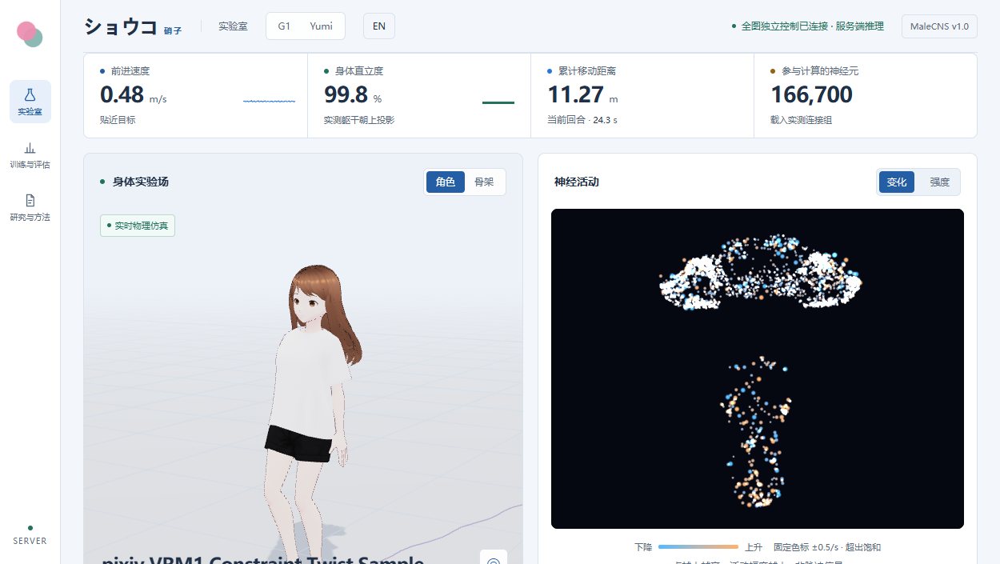
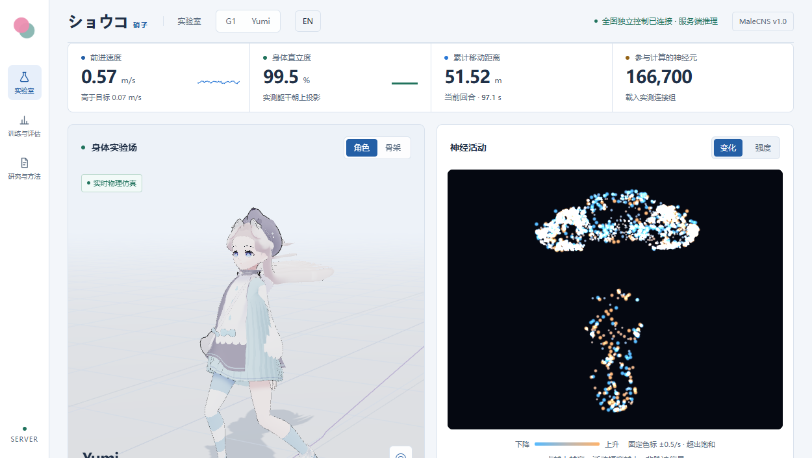

# Shouko · ショウコ

**English** · [简体中文](README.zh.md)

**We trained a fruit fly to drive an anime girl's body. Here is the training process, and how to run and train it locally.**

Her full name is ショウジョウバエ. A public male *Drosophila* connectome dataset is her brain; the girl is the VRM character [Yumi](research/avatar/YUMI.md). Everything runs in a MuJoCo physics simulation.

## Overview
We set out to validate one engineering chain: **turn a fruit fly's real neural wiring into a control network, and let it drive a walking body.**

A fly's **connectome** records which neuron connects to which. It carries no brain function by itself. This project imports that wiring list as a neural network, trains it to output 12 joint targets, hands them to MuJoCo for gravity and contact, and lets the character skeleton follow the same physical state.

The data is [MaleCNS v1.0](https://male-cns.janelia.org/): **166,700 neurons and 25,582,938 connections**. The project has gone through three generations:

| Generation | Scale | Body | Status |
|---|---|---|---|
| Subgraph prototype | 8,192 neurons | G1 proxy + frozen gait policy | Accepted |
| Cloud full connectome | Full connectome | G1 proxy | Accepted |
| **Current mainline** | Full connectome | **Yumi body** | Accepted, real-time local preview |

### Results

| | Full-graph G1 body | Yumi body |
|---|---|---|
| 9 fresh initial states × 30 s | 9/9 | 9/9 |
| 120 s continuous walk | 55.40 m | 65.55 m (0.13 m lateral drift) |
| Lateral push recovery | 3/3 | 3/3 |
| Brain connections severed | 3/3 fall (≈1.4 s) | 3/3 fall (≈1 s) |
| Record / checkpoint | `runs/local/heldout.json`, `f1d5147c` | `runs/local/heldout_yumi.json`, `a7a4281f` |

Sever the brain connections, keep the body and output layer intact, and the character falls in about a second: walking depends on this wiring. G1 and Yumi have different body parameters, so weights do not transfer between them.

### Not attempted yet

A same-scale random-network control, rough terrain, starting and stopping, upper-limb balance, natural human gait. The full list is in section 5 of the [research report](research/REPORT.md).

### Future work

Proposals come from the technical reviews in `research/experiments/`.

**Upper limbs.** Above the pelvis, the chest, neck, head and both arms are one 25.7 kg capsule welded to the pelvis, leaving 13 bodies in the physics model; arm swing is a frontend JS tween driven by leg angle and takes no part in balance. Running cannot be built on that: a leg kicking forward at speed generates a large yaw moment, and without counter-swinging arms acting as a momentum flywheel the torso whips sideways and the character falls. Once both feet leave the ground, ground reaction moments are zero and arm swing is the only way to tune the landing angle in the air.

**Running.** The gait clock is hardcoded to `2π / 0.8`, sized for G1's short legs. Yumi's legs are nearly 1 m, so a 0.8 s cycle at walking speed only produces cramped small steps. Running needs a retuned clock, a flight phase and speeds above 1.2 m/s.

**Dopamine-driven learning.** Dynamics are a rate approximation — no STDP, no dopamine reward learning — and connection gains have to stay frozen to remain stable; unfreezing them collapses the policy within 12 iterations. The fly's mushroom body is a textbook biological actor-critic: Kenyon cells encode sparse state, MBONs read out value, dopaminergic neurons carry TD error. Rewriting this as a three-factor local plasticity rule would let the network learn online the way a real animal does, without the global backprop that shakes the synapses apart.

**Visual obstacle avoidance.** The optic lobe holds over 60% of the brain's neurons, and the optomotor response and giant-fiber looming escape circuit are hardware that evolution spent tens of millions of years building. Feeding depth or optical flow straight into the visual projection neurons should produce a steering reflex on its own, with no separate CNN to train.

## Training Approach & Details
### Data flow

```text
User target speed / heading + MuJoCo body observation (47 dims)
    ↓ trainable sensory encoder
Data-labelled sensory neurons
    ↓ 4 rate updates per decision, propagating only along measured pre → post edges
166,700 neurons / 25,582,938 connections
    ↓
Data-labelled VNC / CB motor neurons (readout)
    ↓
12 joint targets → PD torque → MuJoCo gravity and contact
    ↓
Pose feedback; the VRM skeleton displays the same physical state
```

Edge weights come from `sign × sqrt(contact count)`, normalized per target node. Acetylcholine is treated as excitatory, GABA, glutamate and histamine as inhibitory, neuromodulators and unknown classes default to positive — a simplification policy, not a per-synapse receptor measurement. Dynamics use a rate approximation (`r ← a·r + b·tanh(W·r + sensory drive)`) with no neural memory across decisions, no STDP and no dopamine reward learning. Sensory drive enters the input group only, the output group does not overlap it, and no path bypasses the network to reach the joints.

Neuron biases, sensory encoding, connection gains and motor output train together: 26,575,852 trainable parameters, with about 81.9% of connection gains changed by the end.

### How it trains

An existing G1 walking policy acts as the teacher, demonstrating actions that backprop trains the whole control path. The student then walks on its own, and the states it stumbles into go back to the teacher for correct action labels, iterating (**DAgger**). The teacher takes part in training only; evaluation and preview drive the joints straight from the connectome policy.

A new body means retraining. G1 is Unitree's humanoid robot model; Yumi is a 12-joint body rebuilt from the VRM character's measured skeleton (hip height 0.97231 m, roughly 1.55 m overall, 38 kg assumed from Dempster segment ratios). Joint order, axes and zero positions match, so the network interface is unchanged; height, mass, torque limits and fall thresholds differ, and a G1 checkpoint on the Yumi body falls in about 1.6–1.8 s. Even the G1 teacher driving Yumi directly lasts only about 1.7 s. The Yumi stage uses **PPO** to fine-tune from the G1 checkpoint: reward = speed tracking + upright + heading + survival + alternating foot contact − action penalties − fall termination, lr 1e-4, target_kl 0.015, 32 worlds × 128 steps, about 37 s per iteration locally and 9 s per iteration on a cloud 4090D.

The first cloud acceptance run was bottlenecked by heading hold (3.7–12.2 m lateral drift), with survival and gait already solved. Lengthening training and evaluation episodes to 30 s and adding lateral and heading penalties to the reward produced the Yumi results above in the second round.

### Compute and cost

- Local: Ryzen 9 7940HX, ~16 GB RAM, RTX 4070 Laptop 8 GB. The subgraph prototype trained and evaluated in about 183 s; the full graph runs inference only on this machine, with a median 10.04 ms per decision.
- Cloud: AutoDL RTX 4090D. Full-graph training first OOM'd in PyTorch CSR backprop trying to allocate a ~103.52 GiB dense matrix; computing connection gradients only at sparse positions fixed it. Peak tensor VRAM at batch 256 was about 4.42 GiB, and two training rounds took about 13.2 minutes of process time.
- Cost: ¥0.414 is process time multiplied by the hourly rate. The actual bill runs on total powered-on hours in GPU mode (¥1.88/hour), idle time included, with the no-GPU mode billed separately. Local inference does not shut down the cloud instance.

## Running Locally
You need a prepared GPU environment and checkpoint (`.venv-gpu\Scripts\python.exe` and `runs/cloud/best.pt` or `runs/yumi/best.pt`). See the [local usage, resources and reproduction guide](research/guides/LOCAL.md) for how to prepare them.

```powershell
cd D:\Project\Neuromechfly
.\start.ps1 -Body g1   # or -Body yumi, -Device cpu on a CPU-only machine
```

Open the [studio](http://127.0.0.1:8740). The VRM character on the page walks in real time, with every action computed on your machine.

| G1 body (pixiv sample avatar) | Yumi body |
|---|---|
|  |  |

Both panels are the same live studio: the left pane renders the physics-driven VRM character and gait stats, the right pane shows 2,048 sampled neuron activity rates of the 166,700-neuron connectome.

- Defaults to the G1 body and CUDA. The page's top bar switches between G1 and Yumi live; training must not be running.
- `.\stop.ps1` stops it. The startup log is `runs/cloud/server-error.log` (or `runs/yumi/server-error.log`).
- On an RTX 4070 Laptop 8 GB the median decision is 10.04 ms and the Yumi page measured 1.00× real time; heavy system load drops it to 0.7–1.0×.

The UI supports pause, resume, reset, target speed and heading, lateral pushes, character/skeleton toggle, connection severing, retraining, training curves and raw evaluation. Retraining archives the previous round's core results. Hair and upper-limb display following stay out of the physics evaluation.

### Run modes

| Mode | Entry | Address | Notes |
|---|---|---|---|
| Local studio (mainline) | `.\start.ps1 [-Body g1|yumi]` | 8740 | Full connectome + MuJoCo locally; body switchable in the page |
| Cloud full graph | `.\cloud.ps1 Preview` | 8742 | AutoDL instance over an SSH tunnel, bound to localhost |

The 8,192-neuron subgraph prototype (`app/server.py`) remains as legacy code without a start script.

On the cloud side, `./cloud.ps1 Status` reports state, `./cloud.ps1 Train -Seconds 1800` resumes training from a checkpoint, and `./cloud.ps1 Sync` syncs code and UI. The SSH target is machine-specific: pass `-CloudHost user@host -CloudPort 12345`, or write it once to `runs/cloud/target.json` (git-ignored) as `{"host": "user@host", "port": "12345"}`. Training does not shut down the instance; the preview keeps running and keeps billing.

### Checkpoint lineage note

`runs/yumi/best.pt` is the 9/9-accepted checkpoint (`a7a4281f`, matching the recorded evaluation). The later `home`-upright lineage (`666134f2`) is preserved as `runs/yumi/best_tall.pt` but was trained against a different `default_angles` baseline and is not usable with the current `yumi.yaml`. Background and disposition in the [home reference mismatch record](research/experiments/HOME_REFERENCE_MISMATCH_20260916.md).

## Reproducing the Training
### From a clean environment (subgraph prototype)

Needs Python 3.12, uv, Node.js 20.19+ or 22.12+, and Git. Setup downloads about 1.1 GB of raw connectome data.

```powershell
.\setup.ps1
.\start.ps1
```

`.venv` isolates the project and leaves your global Python alone. Vendor repositories and large data stay out of normal Git history. `setup.ps1` builds the subgraph prototype environment; it does not include the `.venv-gpu` and checkpoints the Yumi version needs.

### Training the subgraph prototype

```powershell
.venv\Scripts\python.exe -m app.prepare
.venv\Scripts\python.exe -m app.train --samples 1536
.venv\Scripts\python.exe -m app.check
npm run build
```

The server serves the built page, so rebuild after frontend changes and refresh the browser.

### Cloud full-graph training (G1 body)

The cloud instance reuses the base PyTorch 2.12.1+cu130 image, with dependencies pinned in `requirements.cloud.lock.txt`. Do not overwrite a cloud environment with the local CPU prototype installer. Instance configuration, benchmarks and cost records are in the [cloud measurements, cost and reproduction record](research/guides/CLOUD.md).

```bash
cd /root/autodl-tmp/neuromechfly
.venv/bin/python -m app.launch_cloud train --seconds 600
.venv/bin/python -m app.evaluate_full
.venv/bin/python -m app.check_full
```

Run acceptance after the training process exits. The acceptance script neither trains nor selects checkpoints.

### Yumi body acceptance

```powershell
.venv-gpu\Scripts\python.exe -m app.evaluate_full --robot yumi --checkpoint runs/yumi/best.pt --output runs/local/heldout_yumi.json
```

Measured Yumi skeleton dimensions, physics body construction and the numerical screen-consistency check are in the [Yumi body adaptation record](research/avatar/YUMI_BODY.md); training and tuning notes live in `research/experiments/`.

### Publishing and verifying artifacts

Trained weights (`runs/cloud/best.pt`, `runs/yumi/best.pt`) are too large for the repository and are published via the release channel once the remote repository exists. Every publishable artifact — weights, optimizer states, evaluation records, VRM hashes — is listed with its full SHA-256 in [research/provenance/release.json](research/provenance/release.json). Regenerate or verify it with:

```powershell
python research/provenance/release_manifest.py generate   # recompute all hashes
python research/provenance/release_manifest.py validate   # check files against the manifest
```

Downloaded release files can be checked against the same manifest before use; the page's evaluation panel only serves records bound to the loaded checkpoint's hash.

### Key files

- `app/prepare.py`: validates and streams the dataset, builds a traceable subgraph.
- `app/full_brain.py`: sensory encoding, measured sparse connections and trained readout for the full connectome.
- `app/yumi_skeleton.py`, `app/yumi_description/`: parse the skeleton from the VRM and build the Yumi physics body.
- `app/sim.py`: MuJoCo physics and G1 / Yumi body switching.
- `app/train_full.py`, `app/ppo_yumi.py`: DAgger training and Yumi's PPO fine-tuning.
- `app/cloud_server.py`, `app/server.py`: real-time event stream, training control and preview.
- `web/`: Three.js / VRM visualization and the Chinese experiment UI.
- `research/REPORT.md`: literature review, method, results, compute and unfinished scope.

## About
### License

The project's own code and documentation are released under the [MIT License](LICENSE). MIT is compatible with every bundled upstream license: the permissive ones (FlyCube, DOOMFLY, three-vrm, Three.js, Vite, FastAPI — MIT; Unitree RL Gym, NumPy, SciPy, Uvicorn — BSD-3-Clause; MuJoCo — Apache-2.0; PyTorch — BSD-style) only require retaining their notices, which stay in `vendor/` checkouts and the installed packages; `app/sim.py` keeps its Unitree adaptation note in the file header.

MIT covers this repository's code only and does not override the data and asset terms: the MaleCNS dataset stays CC BY 4.0 (attribution required), the pixiv VRM sample stays under VRM Public License 1.0, and the Yumi VRM is not redistributed at all under its author's terms. Third-party components are listed in [THIRD_PARTY.md](THIRD_PARTY.md), with license copies under `research/provenance/licenses/`:

- **MaleCNS v1.0** (connectome data): FlyEM / HHMI Janelia and collaborators, CC BY 4.0. We normalize records, select a subgraph, convert contact counts into signed weights and define new dynamics; these transformations are not physiological measurements.
- **Unitree RL Gym**: BSD-3-Clause, providing the G1 model, pretrained checkpoint and simulation conventions.
- **VRM1_Constraint_Twist_Sample** v1.0.1: pixiv, VRM Public License 1.0, redistribution and modification permitted ("Hikari" is a UI nickname).
- **FlyCube**, **DOOMFLY**: MIT, source of the MaleCNS downloader, importer and transmitter sign policy.
- **NeuroMechFly / FlyGym**: research reference for hierarchical control; no code bundled.
- **MuJoCo** (Apache-2.0), **PyTorch**, **NumPy / SciPy**, **Three.js / three-vrm**, **Vite**, **FastAPI / Uvicorn** and other dependencies keep their notices in the installed packages.

This experiment is not affiliated with or endorsed by the cited researchers or organizations.

### Assets and models

**Yumi** (1.3.0 / 20240715) — concept: 松酒; artist: 7Apoi; model: 星晨水影工作室; publisher: 墨海徽 ([author's release page](https://www.bilibili.com/video/BV1uG411f72b/)). File `web/public/yumi.vrm`, 25,754,408 bytes, SHA-256 `3f1eaf57…`, path listed in `.gitignore`. The author permits non-profit use, monetized livestreams and derivative works, prohibits redistribution and resale, and the embedded metadata prohibits sexual and violent use. Details in the [Yumi provenance record](research/avatar/YUMI.md).

**Weights and data**: `runs/cloud/best.pt` (`f1d5147c`, G1), `runs/yumi/best.pt.bak` (`a7a4281f`, accepted Yumi version); `data/full_graph.npz` enforces SHA-256 validation on load, with the provenance manifest in `research/provenance/provenance.json`.

### Disclaimer

Research experiment code. Results cover flat-ground walking only, with no validation on a real robot. The developers accept no responsibility for any direct or indirect consequences of using this project.