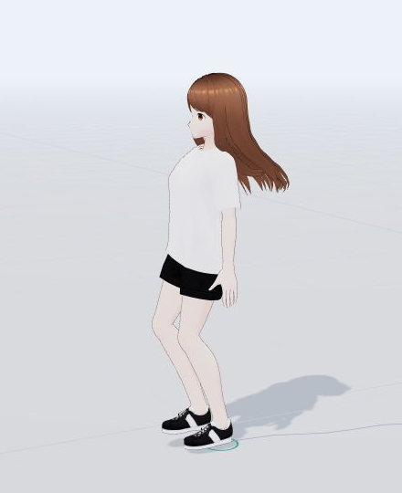
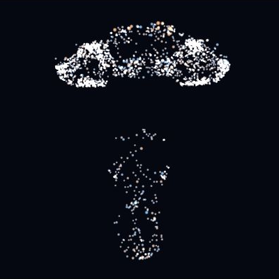
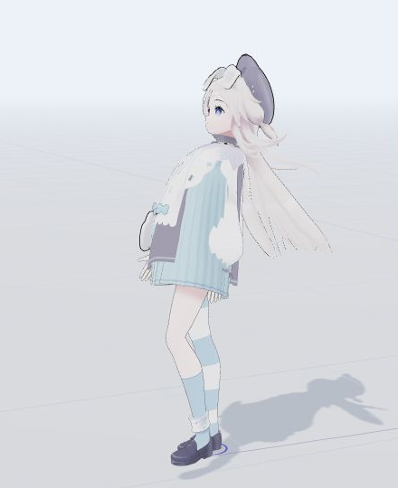
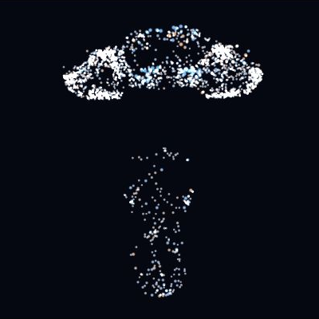

# ショウコ · 硝子

[English](README.md) · **简体中文**

**我们训练了一个果蝇连接组网络，让它控制 Yumi 的下肢在平地行走。以下是训练过程，以及如何在本地运行和训练。**

她的全名是 ショウジョウバエ。公开的雄性果蝇连接组数据是她的脑，美少女是 VRM 角色 [Yumi](research/avatar/YUMI.md)，实验跑在 MuJoCo 物理模拟里。

## 状态预览

**当前已实现：Yumi 下肢平地行走。** 策略控制髋、膝、踝共 12 个关节，每条腿 6 个。物理模型中的上半身固定在骨盆上；画面中的摆臂是显示动画，策略尚未控制上肢，也未用上肢参与平衡。

| 身体 / 阶段 | 行走中的模型 | 同一时刻的神经活动 |
|---|---|---|
| **G1 · 前序阶段**<br>`ffcf9a97` · 8.28 秒 |  |  |
| **Yumi · 当前 v0.2.0**<br>`f1a20071` · 8.26 秒 |  |  |

每组来自目标速度 0.50 m/s、朝向 0° 下真实行走的一帧；暂停后分别截取模型与神经活动，保证同组对应同一仿真时刻。神经图展示 **166,700 个神经元中的 2,048 个胞体采样点**，使用固定 ±1 色标的带符号模型活动（蓝色为负，橙色为正）。这不是生物脉冲记录，也不是新增验收成绩。[截图参数与哈希](assets/preview-metadata.json)。

G1 图使用后续检查点 `ffcf9a97`（[留出记录 6/9](research/experiments/G1_CHECKPOINT_REBIND_20260918.md)）；下方历史 9/9 属于 `f1d5147c`。Yumi 图对应当前发行主模型。G1 角色：© 2022 pixiv Inc.；Yumi：原设松酒、画师 7Apoi、模型星晨水影工作室、发布墨海徽。[资产署名说明](THIRD_PARTY.md)。

| 阶段 | 范围与状态 | 预览 / 验收依据 |
|---|---|---|
| **当前：下肢行走（v0.2.0）** | 完整连接组读出迁移 `f1a20071`，四组严格留出通过；精确朝向与横漂仍待解决 | 上方预览与下方成绩 |
| 下一阶段（预留） | 范围与验收标准待确定 | 待补充 |
| 后续阶段（预留） | 阶段确定后填写 | 待补充 |

预留行用于后续已确定的阶段，不代表排期承诺，也不表示研究候选已经实现。

## 概述
我们想验证一条工程链路：**把果蝇的真实神经接线接成一个控制网络，让它驱动一个身体走路。**

果蝇脑的**连接组**（connectome）记录的是“哪个神经元连到哪个”，不含大脑本身的功能。本项目把这份接线清单导入成神经网络，训练它输出 12 个下肢关节动作，交给 MuJoCo 计算重力和接触，角色骨骼跟随同一份物理状态。

数据来自 [MaleCNS v1.0](https://male-cns.janelia.org/)：**166,700 个神经元、25,582,938 条连接**。项目经过三代：

| 代 | 规模 | 身体 | 状态 |
|---|---|---|---|
| 子图原型 | 8,192 神经元 | G1 代理 + 冻结步态策略 | 已验收 |
| 云端全图 | 完整连接组 | G1 代理 | 已验收 |
| **当前主线** | 完整连接组 | **Yumi 下肢** | v0.2.0 完整连接组读出迁移通过文档规定的步态验收，本地可实时预览 |

### 历史下肢行走成绩

以下结果仅对应表中列出的行走检查点，不构成上肢控制、跑步或自然人体步态的验收。

| | 全图 G1 身体 | Yumi 深蹲世系 `a7a4281f` |
|---|---|---|
| 9 个新初态 × 30 秒 | 9/9 | 9/9 |
| 120 秒持续行走 | 55.40 m | 65.55 m（横漂 0.13 m） |
| 侧向轻推恢复 | 3/3 | 3/3 |
| 断开脑内连接 | 3/3 跌倒（约 1.4 秒） | 3/3 跌倒（约 1 秒） |
| 记录 / 检查点 | `runs/local/heldout.json`，`f1d5147c` | `runs/local/heldout_yumi.json`，`a7a4281f` |

断开脑内连接、保留身体和输出层，角色约 1 秒跌倒——行走依赖这份接线。G1 与 Yumi 的身体参数不同，权重不通用。

### v0.2.0 发行模型（`f1a20071`）

默认模型冻结已训练的完整连接组核心，只拟合 9,792 个读出参数。Yumi MLP 教师负责训练数据标注；运行时仅由连接组控制。显式相位输入仍保留。

| 严格留出组 | 主模型 | 独立数据分支 |
|---|---:|---:|
| 常规初态，30 秒 | 27/27 | 27/27 |
| 初始偏航 ±0.2 rad | 18/18 | 18/18 |
| 持续行走，120 秒 | 9/9 | 9/9 |
| 指定侧向脉冲 | 9/9 | 9/9 |

全部组零跌倒。严格验收要求每只脚每秒至少一次合格摆动。两个模型的原生 CSR 复核也均为 27/27。独立分支额外使用一轮 DAgger，不是等预算复现。

当前判据允许一定横漂：主模型 120 秒平均横漂 **5.47 m**，精确朝向恢复 **9/18**。通过不代表精确直线行走、自然步态、自主 CPG 或连接组拓扑优势。上方旧成绩使用不同判据，不是配对比较。详见[模型卡](research/releases/v0.2.0/MODEL_CARD.md)和[训练记录](research/experiments/CONNECTOME_TRANSFER_20260923.md)。

### 历史直立源模型（`458fc465`）

之前未发布的 v0.2.0 计划使用直立姿态 obs50 世系（`458fc465`）：骨盆约 0.90 m 直立（深蹲世系约 0.83 m），50 维观测，物理接口内嵌在检查点内。其留出验收记录（与上表同种子、同判据）：

| 留出检查 | 结果 |
|---|---|
| 9 个新初态 × 30 秒（六判据全过） | 0/9 严格成功；8/9 存活，交替步态保持 |
| 120 秒持续行走 | 存活，前进 10.99 m，横漂 15.43 m |
| 侧向轻推恢复 | 3/3 不倒 |
| 断开脑内连接 | 3/3 跌倒（约 1 秒） |
| 记录 / 检查点 | `runs/yumi/evaluations/95111ceac1b4434696896fedbeb9c7bb/heldout.json`，`458fc465` |

本阶段成立的部分：直立姿态、存活、交替节律、轻推恢复与连接组依赖性，以及校准后的原生评估基线。不成立的部分：定向速度/朝向跟踪——这是当时路线的开放目标（见[路线决策记录](research/experiments/ROUTE_DECISION_20260922.md)）。上方深蹲世系的 9/9 记录仍然有效，并绑定其自身检查点。

### 尚未进行

同规模随机网络的对照、复杂地形、起步停步、上肢平衡、自然人体步态。完整清单见[研究报告](research/REPORT.md)第 5 节。

### 后续工作

以下是 `research/experiments/` 技术复盘中的候选方向，尚未成为确定阶段或已验收能力。范围与验收标准确定后，再补入上方阶段表。

**接入上肢。** 骨盆以上的胸、颈、头和双臂目前是焊在骨盆上的一个 25.7 kg 实心胶囊体，物理里只有 13 个 bodies；手臂摆动是前端 JS 按腿角做的视觉补间，不参与平衡。跑步建在这上面不成立：单腿高速前踢产生很大的 Z 轴扭力，没有反向摆臂当动量飞轮，躯干会在空中甩动摔倒；双脚离地后地面外力矩归零，挥臂是空中唯一能调落地迎角的手段。

**稳定跑步。** 步频写死在 `2π / 0.8`，是按 G1 的短腿定的；Yumi 腿长近 1 m，0.8 秒周期在行走速度下只能走出局促的小碎步。跑步要重调时钟、加入腾空相、把速度抬到 1.2 m/s 以上。

**多巴胺驱动学习。** 现在的动力学是活动率近似——没有 STDP，没有多巴胺奖励学习——而且连接增益必须冻结才稳得住，解冻后 12 轮内策略就崩。果蝇的蘑菇体是生物强化学习的教科书原型：肯扬细胞做稀疏状态编码，MBON 做价值读出，多巴胺能神经元传递 TD 误差。把这套改写成三因子局部可塑性规则，网络就能像真实生物一样在线学习，不必依赖会把突触震散的全局反向传播。

**视觉避障。** 视叶占全脑 60% 以上的神经元，光流运动反应和巨纤维膨胀逃逸回路是演化了数千万年的硬件。把深度图或光流直接接进视叶投射神经元，就能天然激发出转向避障反射，不需要另训一个 CNN。

## 训练思想与细节
### 数据流

```text
用户目标速度 / 目标朝向 + MuJoCo 身体观测（47 维）
    ↓ 可训练的感觉编码器
数据标注的感觉神经元
    ↓ 每次决策 4 次活动率更新，只沿实测 pre → post 边传播
166,700 个神经元 / 25,582,938 条连接
    ↓
数据标注的 VNC / CB 运动神经元（读出）
    ↓
12 个下肢关节目标 → PD 力矩 → MuJoCo 重力与接触
    ↓
实际位姿反馈；VRM 骨骼显示同一物理状态
```

边权由 `sign × sqrt(接触计数)` 生成，按目标节点归一化。乙酰胆碱按兴奋处理，GABA、谷氨酸、组胺按抑制处理，神经调质和未知类别默认正号——这是简化政策，不是逐突触的受体测量。动力学用活动率近似（`r ← a·r + b·tanh(W·r + 感觉输入)`），不做跨决策的神经记忆，也没有 STDP 或多巴胺奖励学习。感觉编码只注入输入组，输出组与输入组不重叠，没有绕开网络直达关节的通路。

神经元偏置、感觉编码、连接增益和运动输出一起训练，共 26,575,852 个可训练参数，最终约 81.9% 的连接增益发生变化。

### 训练方式

v0.2.0 的最终阶段使用学生状态 DAgger、脉冲扰动数据和岭回归拟合读出。核心相对直立源模型保持冻结。下文介绍早期 G1 和 Yumi PPO 世系。

先用现成的 G1 行走策略当教师示范动作，反向传播训练整条控制路径；再让学生自己走，把学生走歪时遇到的状态交给教师标注正确动作，迭代训练（**DAgger**）。教师只参与训练，评估与预览都直接由连接组策略控制关节。

换身体要重新训练：G1 是宇树的人形机器人模型，Yumi 是按 VRM 角色实测骨架重建的 12 关节身体（髋高 0.97231 m、整体约 1.55 m、质量 38 kg 为 Dempster 比例假设）。两者关节顺序、轴向、零位一致，脑网络接口不用改；身高、质量、力矩上限和跌倒阈值不同，G1 检查点直接放到 Yumi 身上约 1.6–1.8 秒跌倒，连 G1 教师直接驱动也只能撑约 1.7 秒。Yumi 阶段用 **PPO** 从 G1 检查点做强化学习微调：奖励 = 速度跟踪 + 直立 + 朝向 + 存活 + 双足交替 − 动作惩罚 − 跌倒终止，lr 1e-4、target_kl 0.015、32 worlds × 128 steps，本地约 37 秒/迭代，云端 4090D 约 9 秒/迭代。

第一次云端验收的瓶颈是航向保持（横向漂移 3.7–12.2 m），存活与步态已经解决。把训练和评估回合加长到 30 秒、奖励里加横向与航向罚项后，第二轮拿到上面的 Yumi 成绩。

### 算力与成本

- 本地：Ryzen 9 7940HX、约 16 GB 内存、RTX 4070 Laptop 8 GB。子图原型的完整训练与评估约 183 秒；全图在本机只做推理，单次决策中位数 10.04 ms。
- 云端：AutoDL RTX 4090D。全图训练最初在 PyTorch CSR 反向传播时申请约 103.52 GiB 稠密矩阵而 OOM，改成只算稀疏位置的连接梯度后通过；批次 256 峰值张量显存约 4.42 GiB，两轮训练进程合计约 13.2 分钟。
- 成本：¥0.414 是训练进程耗时乘小时报价，实际账单按有卡模式的**开机总时长**计算（¥1.88/小时），GPU 空闲照扣，无卡模式另计。本地推理不会关闭云实例。

## 本地运行
全新检出请按 [v0.2.0 工作室安装说明](research/releases/v0.2.0/STUDIO.md)下载公开权重和图数据、校验哈希并安装默认模型。已有环境可直接运行：

```powershell
cd D:\Project\Neuromechfly
.\start.ps1            # 默认 Yumi + CUDA
```

打开 [实验室](http://127.0.0.1:8740)。页面上的 VRM 角色实时行走，动作由本机算出来。

两栏是同一个实时工作室：左侧展示下肢行走与步态指标，摆臂属于显示动画；右侧是 166,700 神经元连接组中 2,048 个采样胞体的活动率。

- 默认 Yumi 身体 + CUDA。页面顶栏可直接在 G1 / Yumi 之间热切换（训练运行中会拒绝切换）。
- 停止用 `.\stop.ps1`，启动日志在 `runs/cloud/server-error.log`（或 `runs/yumi/server-error.log`）。
- RTX 4070 Laptop 8 GB 单次决策中位数 10.04 ms，Yumi 页面实测 1.00× 实时；系统负载高时降到 0.7–1.0×。

界面支持暂停、继续、重置、调节目标速度和朝向、侧向扰动、角色/骨架切换、断连对照、重新训练、训练曲线与原始评估，重新训练会归档上一轮核心结果。头发和上肢的显示跟随不参与物理评估。

### 运行模式

| 模式 | 入口 | 地址 | 说明 |
|---|---|---|---|
| 本机实验室（主线） | `.\start.ps1 [-Body g1\|yumi]` | 8740 | 本机跑完整连接组 + MuJoCo，身体在页面内切换 |
| 云端全图 | `.\cloud.ps1 Preview` | 8742 | AutoDL 实例，经 SSH 隧道访问，只监听本机地址 |

8,192 神经元子图原型（`app/server.py`）保留为 legacy 代码，不再有启动脚本。

云端另有 `./cloud.ps1 Status` 查状态、`./cloud.ps1 Train -Seconds 1800` 从检查点续训、`./cloud.ps1 Sync` 同步代码和 UI。SSH 目标因机器而异：用 `-CloudHost user@host -CloudPort 12345` 传入，或一次性写入 `runs/cloud/target.json`（已加入 .gitignore），格式为 `{"host": "user@host", "port": "12345"}`。训练结束不会自动关闭实例，预览服务继续跑、继续计费。

### 检查点世系说明

`runs/yumi/best.pt` 现为 v0.2.0 主模型 `f1a20071`。源模型 `458fc465` 保留在 `runs/yumi/upright-source.pt`，也随发行包作为 `models/upright-source.pt` 提供。安装脚本在切换前将旧默认权重、训练记录和优化器状态归档到 `runs/yumi/archive/`。

旧深蹲模型 `a7a4281f` 仍可从公开 v0.1.0 Release 获取，历史成绩继续绑定原模型。新端点没有匹配的 PPO 优化器状态。页面仅在权重哈希、Yumi 身体和物理接口均匹配时展示发行评估。

## 复现训练过程
### 从干净环境开始（子图原型）

需要 Python 3.12、uv、Node.js 20.19+ 或 22.12+、Git，准备阶段下载约 1.1 GB 连接组原始数据。

```powershell
.\setup.ps1
.\start.ps1
```

`.venv` 隔离项目环境，不影响全局 Python。供应商仓库和大型数据不进普通 Git 历史。`setup.ps1` 建立的是子图原型环境，不含 Yumi 版本所需的 `.venv-gpu` 与权重。

### 子图原型的训练

```powershell
.venv\Scripts\python.exe -m app.prepare
.venv\Scripts\python.exe -m app.train --samples 1536
.venv\Scripts\python.exe -m app.check
npm run build
```

服务器运行构建后的页面，改完前端先构建再刷新浏览器。

### 云端全图训练（G1 身体）

云实例复用基础 PyTorch 2.12.1+cu130，依赖锁定在 `requirements.cloud.lock.txt`，不要用本地 CPU 原型的安装脚本覆盖云环境。实例配置、基准数据与费用记录见[云端实测、费用与复现记录](research/guides/CLOUD.md)。

```bash
cd /root/autodl-tmp/neuromechfly
.venv/bin/python -m app.launch_cloud train --seconds 600
.venv/bin/python -m app.evaluate_full
.venv/bin/python -m app.check_full
```

训练进程结束后再跑验收，验收脚本不训练、不选择检查点。

### Yumi 身体的验收

```powershell
.venv-gpu\Scripts\python.exe -m app.evaluate_locomotion --checkpoints runs/yumi/best.pt --seed-base 140001 --output runs/local/v020_normal.json
```

Yumi 的骨架实测尺寸、物理身体建模与画面一致性校验见 [Yumi 身体适配记录](research/avatar/YUMI_BODY.md)，训练调参记录在 `research/experiments/`。

### 发布产物与校验

下载 [v0.2.0](https://github.com/Moemu/Shouko/releases/tag/v0.2.0)：`shouko-v0.2.0.tgz`、`manifest.json` 和 `SHA256SUMS.txt`。包内提供四类权重、完整图、评估证据、最小运行源码和署名。清单把实际运行文件绑定到发行提交。Yumi VRM 和旧 PPO 状态不随包发布。

浏览器安装见 [STUDIO.md](research/releases/v0.2.0/STUDIO.md)，无界面校验见 [REPRODUCE.md](research/releases/v0.2.0/REPRODUCE.md)。旧 `research/provenance/release.json` 是早期本地产物清单，不是 v0.2.0 清单。

### 主要文件

- `app/prepare.py`：校验与流式导入数据，建立可追溯子图。
- `app/full_brain.py`：完整连接组的感觉编码、实测稀疏连接与训练读出。
- `app/yumi_skeleton.py`、`app/yumi_description/`：从 VRM 解析骨架，生成 Yumi 物理身体。
- `app/sim.py`：MuJoCo 物理与 G1 / Yumi 身体切换。
- `app/train_full.py`、`app/ppo_yumi.py`：DAgger 训练与 Yumi 的 PPO 微调。
- `app/studio_server.py`：主线工作室服务、训练控制与哈希绑定的评估展示。
- `web/`：Three.js / VRM 可视化和中文实验界面。
- `research/REPORT.md`：论文调研、方法、结果、算力与未完成范围。

## 关于
### 许可证

本项目自有代码与文档以 [MIT License](LICENSE) 发布。MIT 与所有捆绑的上游许可证兼容：宽松类许可证（FlyCube、DOOMFLY、three-vrm、Three.js、Vite、FastAPI 为 MIT；Unitree RL Gym、NumPy、SciPy、Uvicorn 为 BSD-3-Clause；MuJoCo 为 Apache-2.0；PyTorch 为 BSD 风格）只要求保留其声明，声明随 `vendor/` 检出版与安装包保留；`app/sim.py` 文件头保留 Unitree 适配说明。

MIT 仅覆盖本仓库代码，不覆盖数据与资产的条款：MaleCNS 数据集仍为 CC BY 4.0（需署名），pixiv VRM 示例仍受 VRM Public License 1.0 约束，Yumi VRM 按作者条款完全不再分发。第三方组件见[归属说明](THIRD_PARTY.md)，许可副本在 `research/provenance/licenses/`：

- **MaleCNS v1.0**（连接组数据）：FlyEM / HHMI Janelia 等，CC BY 4.0。本项目对记录做了归一化、选子图、把接触计数转成带符号权重并另定动力学，这些变换不是生理测量。
- **Unitree RL Gym**：BSD-3-Clause，提供 G1 模型、预训练检查点与仿真约定。
- **VRM1_Constraint_Twist_Sample** v1.0.1：pixiv，VRM Public License 1.0，允许再分发与修改（“Hikari”是界面昵称）。
- **FlyCube**、**DOOMFLY**：MIT，复用 MaleCNS 下载、导入与递质符号模块。
- **NeuroMechFly / FlyGym**：分层控制的研究参考，未捆绑其代码。
- **MuJoCo**（Apache-2.0）、**PyTorch**、**NumPy / SciPy**、**Three.js / three-vrm**、**Vite**、**FastAPI / Uvicorn** 等依赖许可随包保留。

本实验与上述研究者或组织无关联、未获其背书。

### 资产与模型信息

**Yumi**（1.3.0 / 20240715）— 原设：松酒；画师：7Apoi；模型：星晨水影工作室；发布：墨海徽（[作者发布页](https://www.bilibili.com/video/BV1uG411f72b/)）。文件 `web/public/yumi.vrm`，25,754,408 字节，SHA-256 `3f1eaf57…`，路径已加入 `.gitignore`。作者允许非盈利使用、盈利直播和二次创作，禁止再分发与二次贩售，内嵌元数据禁止色情与暴力用途。细节见 [Yumi 来源与使用记录](research/avatar/YUMI.md)。

**权重与数据**：`runs/cloud/best.pt`（`f1d5147c`，G1）、`runs/yumi/best.pt.bak`（`a7a4281f`，Yumi 验收版本）；连接组 `data/full_graph.npz` 加载时强制 SHA-256 校验，溯源清单在 `research/provenance/provenance.json`。

### 免责声明

本项目是研究性实验代码。成果只覆盖平地行走，未对真实机器人验证。使用本项目产生的任何直接或间接后果，开发者不承担责任。