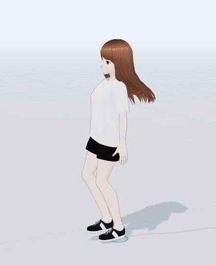
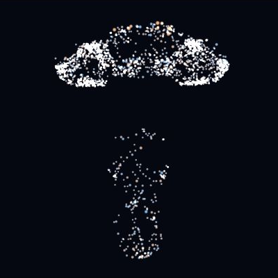
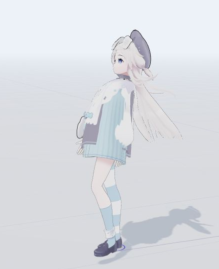
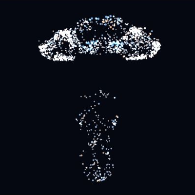

# ショウコ · 硝子

[English](README.md) · **简体中文**

**我们训练了一个果蝇连接组网络，让它控制 Yumi 的下肢在平地行走。以下是训练过程，以及如何在本地运行和训练。**

她的全名是 ショウジョウバエ。公开的雄性果蝇连接组数据是她的脑，美少女是 VRM 格式的虚拟角色 [Yumi](research/avatar/YUMI.md)，实验跑在 MuJoCo（开源物理引擎）的模拟里。

WebGPU 在线预览（v0.2.0）： [Shouko · ショウコ · Studio](https://shouko.snowy.moe/)

**最新权重：[v0.3.0——方向稳定性检查点](https://github.com/Moemu/Shouko/releases/tag/v0.3.0)。** 两份固定检查点各通过 72/72 留出测试。每个模型的 9 次 120 秒长走，全程均未偏离起始中线超过 2 米。[模型卡](research/releases/v0.3.0/MODEL_CARD.md) · [下载与运行](research/releases/v0.3.0/REPRODUCE.md)。

在线预览、截图和默认工作室安装仍为 v0.2.0。v0.3.0 已提供独立的原生 MuJoCo 运行包，生产浏览器预览尚未升级。

## 概述

我们想验证一条工程链路：**把果蝇的真实神经接线接成一个控制网络，让它驱动一个身体走路。** 果蝇脑的**连接组**（connectome）记录的是“哪个神经元连到哪个”，不含大脑本身的功能。本项目把这份接线清单导入成神经网络，训练它输出 12 个下肢关节动作，交给 MuJoCo 计算重力和接触，角色骨骼跟随同一份物理状态。

数据来自 [MaleCNS v1.0](https://male-cns.janelia.org/)：**166,700 个神经元、25,582,938 条连接**。

身体走过两步。前两代用宇树（Unitree）的人形机器人模型 **G1** 作物理代理：8,192 神经元的子图原型把连接组的速度指令交给一套固定不变的官方步态策略执行，完整连接组的云端全图则整路径训练、由连接组直接输出关节目标，两代均通过各自验收。当前主线换到按 VRM 角色实测骨架重建的 **Yumi** 下肢身体：关节顺序、轴向与零位一致，脑网络接口不用改，但身高、质量与力矩不同，权重不通用（见[历史成绩](#历史成绩)）。

### 起因与灵感

果蝇连接组刚开源的时候，围绕它出现了很多有意思的项目。最让我惊奇的是两位 X 用户把果蝇脑塞进了 3D 身体：[@yakshawan](https://x.com/yakshawan) 的 [FFREP](https://heavyrain39.github.io/ffrep/) 用 MaleCNS 训练驱动 SHOKI 四足与 YUMEKA 人形，@satorunet 的 [hae](https://hae.satoru.net/)（[源码](https://github.com/satorunet/hae)）把 FlyWire 连接组做成浏览器里运行的脉冲神经仿真。Shouko 就是这么来的——我也想亲手做一个。

Shouko 与前两者的不同首先在开放程度：训练方法、发行权重和实验记录公开。发行包支持本地推理与评估复现，但不包含完整历史训练数据。其次在进度上，这一点你需要提前知道：不同于前两者的完整四肢控制，Shouko 目前只控制下肢，上半身是一个固定质量块，实现了受控下的稳定平地行走（支持速度与朝向控制，没有引入目标点）。观感不会像前两个那么有趣，但完整四肢已经列在[后续工作](#后续工作)里。我们对这两个项目做了固定版本的资料整理，见 [research/references/fly-embodiment/](research/references/fly-embodiment/README.md)。

我并不了解果蝇仿真背后的原理，只有早些时候学过的一点 NLP 知识，所以把本项目当作多 Agent 协作试验来做：多个独立的前沿模型（GPT 6 Astra、Kimi K3、Qwen 3.8 Max 等）各自带着 Harness 并行讨论提案与训练，由 GPT 6 Astra 作为主协调负责具体训练与目标设定，训练跑在 AutoDL 云端的 RTX 4090D 上。

欢迎社区复现（见[本地运行](#本地运行)与[复现训练过程](docs/TRAINING.md)）与反馈建议；完整四肢、跑步、基于多巴胺的目标奖励等后续方向见[后续工作](#后续工作)一节。

### 当前状态与发行历史

**当前已实现：Yumi 下肢平地行走，横向漂移已有改善。** 策略控制髋、膝、踝共 12 个关节，每条腿 6 个。物理模型中的上半身固定在骨盆上；画面中的摆臂是显示动画，策略尚未控制上肢，也未用上肢参与平衡。

| 身体 / 阶段 | 行走中的模型 | 同一时刻的神经活动 |
|---|---|---|
| **G1 · 前序阶段**<br>`ffcf9a97` · 8.28 秒 |  |  |
| **Yumi · 预览 v0.2.0**<br>`f1a20071` · 8.26 秒 |  |  |

每组来自目标速度 0.50 m/s、朝向 0° 下真实行走的一帧；暂停后分别截取模型与神经活动，保证同组对应同一仿真时刻。神经图展示 **166,700 个神经元中的 2,048 个胞体采样点**，使用固定 ±1 色标的带符号模型活动（蓝色为负，橙色为正）。这不是生物脉冲记录，也不是新增验收成绩。[截图参数与哈希](assets/preview-metadata.json)。G1 图使用后续检查点 `ffcf9a97`（[留出记录 6/9](research/experiments/G1_CHECKPOINT_REBIND_20260918.md)）；下方[历史成绩](#历史成绩)表中的 9/9 属于 `f1d5147c`。G1 角色：© 2022 pixiv Inc.；Yumi：原设松酒、画师 7Apoi、模型星晨水影工作室、发布墨海徽。[资产署名说明](THIRD_PARTY.md)。

| 版本 | 检查点 / 阶段 | 范围 | 状态 |
|---|---|---|---|
| 未发行 | `f1d5147c` · G1 云端全图 | 完整连接组整路径训练，G1 代理 | 已验收 |
| v0.1.0 | `a7a4281f` · Yumi 深蹲世系 | 同一链路换 Yumi 身体 | 已验收 |
| v0.2.0 包内附带 | `458fc465` · Yumi 直立源 | 50 维观测，物理接口内嵌检查点 | 保留基线：直立存活与交替节律成立，定向跟踪未过 |
| **v0.2.0（预览）** | `f1a20071` · 主模型 | 完整连接组读出迁移，Yumi 下肢 | 四组严格留出通过、零跌倒；精确朝向与横漂待解决 |
| **v0.3.0（最新权重）** | `1e1c3160` 主候选 / `fe386851` 验证候选 | 训练侧向速度编码列与读出，共 27,128 个参数 | 各 72/72；120 秒全程 2 米走廊各 9/9；仍有残余漂移 |
| 预留 | 后续阶段 | [后续工作](#后续工作)中的全部方向 | 待补充 |

预留行用于后续已确定的阶段，不代表排期承诺，也不表示研究候选已经实现。

#### 最新成绩（v0.3.0）

主模型 `1e1c3160` 与验证模型 `fe386851` 均在最终留出评估前固定。测试使用 0.35、0.50、0.65 m/s 三档目标速度，两者均零跌倒：

| 留出测试 / 指标 | 主模型 | 验证模型 |
|---|---:|---:|
| 常规起步，30 秒 | 27/27 | 27/27 |
| 初始偏航 ±0.2 rad，30 秒 | 18/18 | 18/18 |
| 长走，120 秒，全程走廊约束 | 9/9 | 9/9 |
| 第 10 秒施加 +0.25 m/s 侧向速度增量 | 9/9 | 9/9 |
| 第 10 秒施加 −0.25 m/s 侧向速度增量 | 9/9 | 9/9 |
| **合计** | **72/72** | **72/72** |
| 120 秒平均绝对终点横移 | 0.489 m | 0.447 m |
| 120 秒各轨迹中的最大横移 | 0.837 m | 0.965 m |

协议 `strict_gait_v2_corridor2` 保留六项行走条件，并要求每脚每秒至少一次合格摆动。合格摆动须离地至少 0.12 秒，足底最小净空的峰值至少为 0.025 m。120 秒组还要求**全程 |y| ≤ 2 m**，只在终点回到走廊内不算通过。其他组沿用严格步态门槛。来源：[与检查点绑定的证据及模型卡](research/releases/v0.3.0/MODEL_CARD.md)。

以上 72 回合使用 ordered CSR 后端、9 个并行世界。独立发行包另通过原生 CSR 单世界检查：每个模型在三档速度下各运行 30 秒，再以高速运行 120 秒，共 **8/8**。这些检查复用了已知种子，不计为新增留出证据。详见[发行验证记录](research/releases/v0.3.0/VALIDATION.md)。

两份模型的训练历史和留出种子不同，不能仅凭最终均值更小就判定模型更优。0.8 秒显式相位与外部偏航反馈仍保留。残余漂移随速度变化，策略也没有绝对横向位置目标。当前结果不证明无限时域的位置保持、任意转向、自然步态、自主 CPG 或生物连接组拓扑优势。

#### 历史成绩

| 检查项 | 全图 G1 身体 `f1d5147c` | Yumi 深蹲世系 `a7a4281f` |
|---|---|---|
| 9 个新初态 × 30 秒 | 9/9 | 9/9 |
| 120 秒持续行走 | 55.40 m | 65.55 m（横漂 0.13 m） |
| 侧向轻推恢复 | 3/3 | 3/3 |
| 断开脑内连接 | 约 1.4 秒跌倒 | 约 1 秒跌倒 |
| 记录 | `runs/local/heldout.json` | `runs/local/heldout_yumi.json` |

断开脑内连接、保留身体和输出层，角色约 1 秒跌倒——行走依赖这份接线。旧成绩使用不同判据，不与当前模型作配对比较。

#### 默认预览成绩（v0.2.0 主模型 `f1a20071`）

预览模型 `f1a20071` 冻结此前训练好的核心，只拟合 9,792 个读出参数。其四组严格留出为 63/63、零跌倒，另行原生 CSR 检查为 27/27。独立数据分支额外使用一轮 DAgger，不是等预算复现。

该版本旧判据下，120 秒平均终点横移为 **5.47 m**，精确偏航恢复为 **9/18**。旧长走判据允许目标距离 20% 的横移，最低允许 1 m；它没有 v0.3.0 的全程 2 米走廊约束。两个版本使用不同留出种子，最终均值不能直接作为配对对照。详见 [v0.2.0 模型卡](research/releases/v0.2.0/MODEL_CARD.md)和[训练记录](research/experiments/CONNECTOME_TRANSFER_20260923.md)。

### 尚未进行

同规模随机网络的对照、复杂地形、起步与停步、上肢平衡、自然人体步态。完整清单见[研究报告](research/REPORT.md)第 5 节。

### 后续工作

以下是研究方向，尚未实现，也不代表固定排期。

**接入上肢。** 上半身目前是固定质量块，摆臂只是显示动画。首个原型需要可动身体、惯性与碰撞参数、执行器，以及对应的观测和动作接口。随后须重验站立与下肢行走，再训练上肢辅助平衡。v0.3.0 保留为下肢基线。

**稳定跑步。** 腾空相、更高速度和步态时序需要独立训练任务与验收标准。当前行走测试通过，不等于已经验证跑步。

**多巴胺驱动学习。** 当前控制器没有 STDP 或多巴胺奖励学习。局部可塑性和奖励调制更新可作为实验方向，其稳定性与控制收益仍需验证。

**视觉避障。** 需要先定义深度或光流输入、感觉到神经元的映射、障碍任务和留出测试。仅接入视觉输入不能证明已产生避障反射。

## 训练思想与细节
### 数据流

```text
用户目标速度 / 目标朝向 + MuJoCo 身体观测（50 维）
    ↓ 感觉编码器
数据标注的感觉神经元
    ↓ 每次决策 4 次活动率更新，只沿实测 pre → post 边传播
166,700 个神经元 / 25,582,938 条连接
    ↓
数据标注的 VNC / CB 运动神经元（读出）
    ↓
12 个下肢关节目标 → PD 力矩 → MuJoCo 重力与接触
    ↓
实际位姿反馈；VRM 骨骼显示同一物理状态
```

输出侧的 815 个运动神经元取自腹神经索（VNC）和中央脑（CB）的标注数据。边权由 `sign × sqrt(接触计数)` 生成，按目标节点归一化。乙酰胆碱按兴奋处理，GABA、谷氨酸、组胺按抑制处理，神经调质和未知类别默认正号——这是简化政策，不是逐突触的受体测量。动力学用活动率近似（`r ← a·r + b·tanh(W·r + 感觉输入)`），不做跨决策的神经记忆，也没有 STDP 或多巴胺奖励学习。感觉编码只注入输入组，输出组与输入组不重叠，没有绕开网络直达关节的通路。

### 训练方式

v0.2.0 的最终阶段：Yumi MLP 教师为训练数据标注动作；学生自己执行，把学生实际会走到的状态（含失败态）交回教师再标注，迭代若干轮（**DAgger**）；在冻结核心缓存的特征上用岭回归解析拟合 9,792 个读出参数。核心（连接、感觉编码、神经元偏置、归一化）相对来源模型逐位冻结。教师只参与训练，评估与预览都由连接组策略独立控制关节。

v0.3.0 在读出之外开放一条感觉通路：世界系侧向速度 `vy` 对应的编码器列，观测索引为 48。它训练 17,336 个编码参数和 9,792 个读出参数，合计 **27,128 个**。连接、神经元偏置、其他编码列与 LayerNorm 相对训练来源保持冻结。教师仍只提供训练标签，部署推理由连接组独立完成。

稳定性实验交叉使用两份数据和两个采样种子。第二段训练后，只读出对照与感觉列加读出分支均通过四种开发配置。该阶段共享一份补充学生状态数据。此前同预算复现曾失败，也尚无“相同更新次数但不增加数据”的对照，因此不能把改进仅归因于开放感觉列。详见[感觉接入编年](research/experiments/SENSORY_ACCESS_20260930.md)与[稳定性验证](research/experiments/SENSORY_STABILITY_20260930.md)。

换身体要重新训练：G1 是宇树的人形机器人模型，Yumi 是按 VRM 角色实测骨架重建的 12 关节身体（髋高 0.97231 m、整体约 1.55 m、质量 38 kg 为 Dempster 比例假设）。两者关节顺序、轴向、零位一致，脑网络接口不用改；身高、质量、力矩上限和跌倒阈值不同，权重不通用。G1 与 Yumi 的早期世系用 PPO 整路径强化学习训练（当时感觉编码、神经元偏置、连接增益与读出一起训练，约 2,658 万参数），过程与调参记录见 `research/experiments/` 与[训练复现指南](docs/TRAINING.md)。

### 算力与成本

- 本地：Ryzen 9 7940HX、约 16 GB 内存、RTX 4070 Laptop 8 GB。全图在本机只做推理，单次决策中位数 10.04 ms。
- 云端：训练在 AutoDL RTX 4090D 实例上进行，按开机总时长计费（GPU 空闲照扣），实例配置、基准与费用记录见[云端实测与复现记录](docs/CLOUD.md)。

## 本地运行

按用途选择运行包：

| 目的 | 版本与说明 |
|---|---|
| 运行最新检查点并复现评估 | [v0.3.0 独立运行包](research/releases/v0.3.0/REPRODUCE.md)，需要 Python 3.12 和 NVIDIA CUDA，不需要 VRM |
| 使用现有角色与神经活动界面 | [v0.2.0 工作室安装](research/releases/v0.2.0/STUDIO.md)，仍是默认预览 |

### 运行与检查 v0.3.0

下载并校验全部五个[发行资产](https://github.com/Moemu/Shouko/releases/tag/v0.3.0)，解压到独立目录，再按 [REPRODUCE.md](research/releases/v0.3.0/REPRODUCE.md) 安装固定版本的依赖。环境就绪后，在解压目录中用 PowerShell 运行：

```powershell
.venv\Scripts\python.exe smoke.py --role primary --output verification/primary_native.json
.venv\Scripts\python.exe smoke.py --role replica --output verification/replica_native.json
```

每条命令先核验包内文件，再执行四项原生 CSR 检查。输出路径必须尚不存在。Linux 命令与完整五组评估见同一说明。该包不会安装网页工作室，也不会替换 `runs/yumi/best.pt`。

### 运行默认工作室（v0.2.0）

全新检出请按 [v0.2.0 工作室安装说明](research/releases/v0.2.0/STUDIO.md)下载公开权重和图数据、校验哈希并安装默认模型。已有环境可直接运行：

```powershell
cd D:\Project\Neuromechfly
.\start.ps1            # 默认 Yumi + CUDA
```

打开 [实验室](http://127.0.0.1:8740)。页面上的 VRM 角色实时行走，动作由本机算出来。两栏是同一个实时工作室：左侧展示下肢行走与步态指标，右侧是 166,700 神经元连接组中 2,048 个采样胞体的活动率。

- 默认 Yumi 身体 + CUDA。页面顶栏可直接在 G1 / Yumi 之间热切换（训练运行中会拒绝切换）。
- 停止用 `.\stop.ps1`，启动日志在 `runs/cloud/server-error.log`（或 `runs/yumi/server-error.log`）。
- RTX 4070 Laptop 8 GB 单次决策中位数 10.04 ms，Yumi 页面实测 1.00× 实时；系统负载高时降到 0.7–1.0×。

界面支持暂停、继续、重置、调节目标速度和朝向、侧向扰动、角色/骨架切换、断连对照（切断脑内连接看是否还能走）、重新训练、训练曲线与原始评估，重新训练会归档上一轮核心结果。头发和上肢的显示跟随不参与物理评估。

### 旧版环境安装

需要 Python 3.12、uv、Node.js 20.19+ 或 22.12+、Git。`setup.ps1` 下载约 1.1 GB 连接组原始数据并建立 `.venv`（子图原型的旧版环境；v0.2.0 的权重与图数据安装不走这条路径，见 [STUDIO.md](research/releases/v0.2.0/STUDIO.md)）：

```powershell
.\setup.ps1
.\start.ps1
```

供应商仓库和大型数据不进普通 Git 历史。

### 安装与验收 v0.2.0 模型

浏览器安装见 [STUDIO.md](research/releases/v0.2.0/STUDIO.md)，无界面校验见 [REPRODUCE.md](research/releases/v0.2.0/REPRODUCE.md)。本地验收命令：

```powershell
.venv-gpu\Scripts\python.exe -m app.evaluate_locomotion --checkpoints runs/yumi/best.pt --seed-base 140001 --output runs/local/v020_normal.json
```

验收脚本不训练、不选择检查点。Yumi 的骨架实测尺寸、物理身体建模与画面一致性校验见 [Yumi 身体适配记录](research/avatar/YUMI_BODY.md)，训练调参记录在 `research/experiments/`。

### 运行模式

| 模式 | 入口 | 地址 | 说明 |
|---|---|---|---|
| 本机实验室（主线） | `.\start.ps1 [-Body g1\|yumi]` | 8740 | 本机跑完整连接组 + MuJoCo，身体在页面内切换 |
| 云端全图 | `.\cloud.ps1 Preview` | 8742 | AutoDL 实例，经 SSH 隧道访问，只监听本机地址 |
| 本地静态预览 | 见 [PREVIEW.md](docs/PREVIEW.md)（导出预览权重包后 `python -m app.serve_preview`） | 8741 | 免服务器预览发行权重包 |

8,192 神经元子图原型（`app/server.py`）保留为旧版（legacy）代码，不再有启动脚本。

云端另有 `.\cloud.ps1 Status` 查状态、`.\cloud.ps1 Train -Seconds 1800` 从检查点续训、`.\cloud.ps1 Sync` 同步代码和 UI。SSH 目标因机器而异：用 `-CloudHost user@host -CloudPort 12345` 传入，或一次性写入 `runs/cloud/target.json`（已加入 .gitignore）。训练结束不会自动关闭实例，预览服务继续跑、继续计费。

### 权重与检查点

v0.3.0 包内提供 `models/primary.pt`（`1e1c3160`）和 `models/replica.pt`（`fe386851`）。完整哈希和训练出处见[模型卡](research/releases/v0.3.0/MODEL_CARD.md)。解压后，它们与已安装的工作室权重分开保存。

默认工作室仍使用 `runs/yumi/best.pt`，即 v0.2.0 主模型 `f1a20071`。其直立来源 `458fc465` 保留在 v0.2.0 包中，旧深蹲检查点 `a7a4281f` 保留在 v0.1.0 中。各版本证据分别绑定原模型。v0.3.0 评估报告同时核验检查点、物理接口和身体 XML 哈希；不要把新权重与旧报告混用。

### 发布产物与校验

从 [v0.3.0](https://github.com/Moemu/Shouko/releases/tag/v0.3.0) 下载全部五个文件：`shouko-v0.3.0.tgz`、`manifest.json`、`primary_native.json`、`replica_native.json` 和 `SHA256SUMS.txt`。将它们放在同一目录，校验时会一并检查两份运行报告。

归档包含两份检查点、完整图、物理身体、评估代码、冻结证据、长走轨迹与署名。清单将全部 55 个包内文件绑定到源码提交 `33465f6`。发行报告记录了从解压包运行的 RTX 4070 Laptop 原生 CSR 检查；此前的留出评估使用 RTX 4090D。

这些资产支持推理与评估复现。包内不含 Yumi VRM、完整历史训练数据、教师与祖先检查点，以及优化器状态。它不承诺逐字节重建训练，也不代表新权重已经通过生产浏览器验收。旧 [v0.2.0 发行](https://github.com/Moemu/Shouko/releases/tag/v0.2.0)继续保留。`research/provenance/release.json` 是早期清单，不是当前发行清单。

## 主要文件

- `app/prepare.py`：校验与流式导入数据，建立可追溯子图。
- `app/full_brain.py`：完整连接组的感觉编码、实测稀疏连接与训练读出。
- `app/yumi_skeleton.py`、`app/yumi_description/`：从 VRM 解析骨架，生成 Yumi 物理身体。
- `app/sim.py`：MuJoCo 物理与 G1 / Yumi 身体切换。
- `app/train_full.py`、`app/ppo_yumi.py`：全图训练与 PPO 微调。
- `app/imitate_yumi.py`、`app/train_sensory_readout.py`：教师标注、学生状态采集，以及读出和感觉列拟合。
- `app/evaluate_direction.py`、`app/release_evidence.py`：方向评估、全程走廊检查与绑定检查点的发行报告。
- `app/export_preview_weights.py`、`app/serve_preview.py`：预览权重导出与本地静态预览服务。
- `app/studio_server.py`：主线工作室服务、训练控制与哈希绑定的评估展示。
- `web/`：Three.js / VRM 可视化和中文实验界面。
- `research/REPORT.md`：论文调研、方法、结果、算力与未完成范围。

## 关于
### 许可证

本项目自有代码与文档以 [MIT License](LICENSE) 发布。MIT 与所有捆绑的上游许可证兼容：宽松类许可证（FlyCube、DOOMFLY、three-vrm、Three.js、Vite、FastAPI 为 MIT；Unitree RL Gym、NumPy、SciPy、Uvicorn 为 BSD-3-Clause；MuJoCo 为 Apache-2.0；PyTorch 为 BSD 风格）只要求保留其声明，声明随 `vendor/` 检出与安装包保留；`app/sim.py` 文件头保留 Unitree 适配说明。

MIT 仅覆盖本仓库代码，不覆盖数据与资产的条款：MaleCNS 数据集仍为 CC BY 4.0（需署名），pixiv VRM 示例仍受 VRM Public License 1.0 约束，Yumi VRM 按作者条款完全不再分发。第三方组件见[归属说明](THIRD_PARTY.md)，许可副本在 `research/provenance/licenses/`：

- **MaleCNS v1.0**（连接组数据）：FlyEM / HHMI Janelia 等，CC BY 4.0。本项目对记录做了归一化、选子图、把接触计数转成带符号权重并另定动力学，这些变换不是生理测量。
- **Unitree RL Gym**：BSD-3-Clause，提供 G1 模型、预训练检查点与仿真约定。
- **VRM1_Constraint_Twist_Sample** v1.0.1：pixiv，VRM Public License 1.0，允许再分发与修改（“Hikari”是界面昵称）。
- **FlyCube**、**DOOMFLY**：MIT，复用 MaleCNS 下载、导入与递质符号模块。
- **NeuroMechFly / FlyGym**：分层控制的研究参考，未捆绑其代码。
- **MuJoCo**（Apache-2.0）、**PyTorch**、**NumPy / SciPy**、**Three.js / three-vrm**、**Vite**、**FastAPI / Uvicorn** 等依赖许可随包保留。

本实验与上述研究者或组织无关联、未获其背书。

### 资产与模型信息

**Yumi**（1.3.0 / 20240715）— 原设：松酒；画师：7Apoi；模型：星晨水影工作室；发布：墨海徽（[作者发布页](https://www.bilibili.com/video/BV1uG411f72b/)）。文件 `web/public/yumi.vrm`，25,754,408 字节，SHA-256 `3f1eaf57…`，路径已加入 `.gitignore`。作者允许非盈利使用、盈利直播和二次创作，禁止再分发与二次贩售，内嵌元数据禁止色情与暴力用途。细节见 [Yumi 来源与使用记录](research/avatar/YUMI.md)。

**权重与数据**：最新发行模型为 v0.3.0 `1e1c3160` / `fe386851`，工作室默认仍为 v0.2.0 `f1a20071`。各自角色和下载出处见[权重与检查点](#权重与检查点)；连接组 `data/full_graph.npz` 加载时强制 SHA-256 校验，溯源清单在 `research/provenance/provenance.json`。

### 免责声明

本项目是研究性实验代码。成果只覆盖平地行走，未对真实机器人验证。使用本项目产生的任何直接或间接后果，开发者不承担责任。
